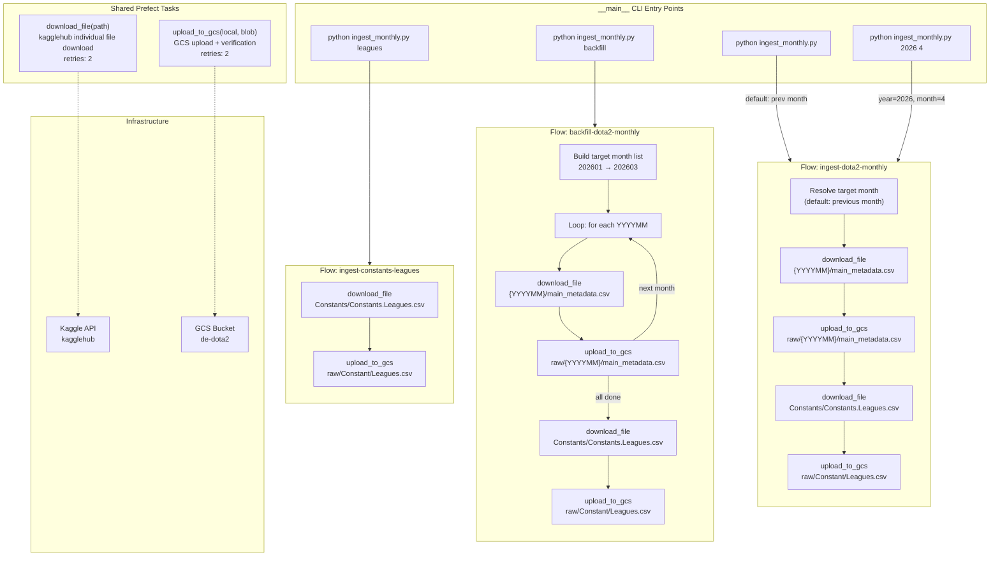

# data-engineering-final-project

I would like to build a data engineering project to import dataset from a kaggle data source to google clound storage. 

step 1: use terraform to create GCS bucket and dataset. the credetials to gcp is stored in the  credetials folder, the settings of terraform is stored in terraform folder
step 2: use python script ingest_dota2_data.py to upload the file from kaggle data source to the gcp project. use Prefect as Orchestration for such purpose
step3: use dbt as transformation tool to process the data and create some data models
step4: display the data in dashboards, for example use powerbi

## Prefect Flow Structure

