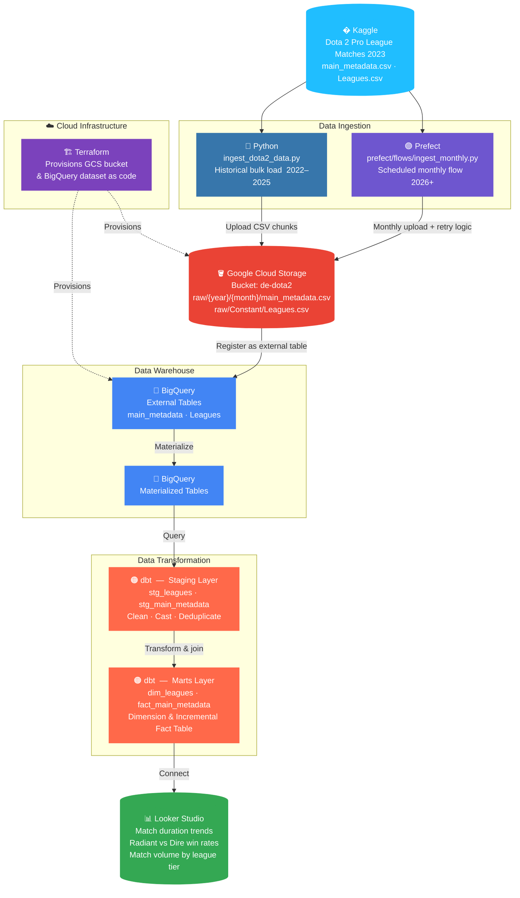
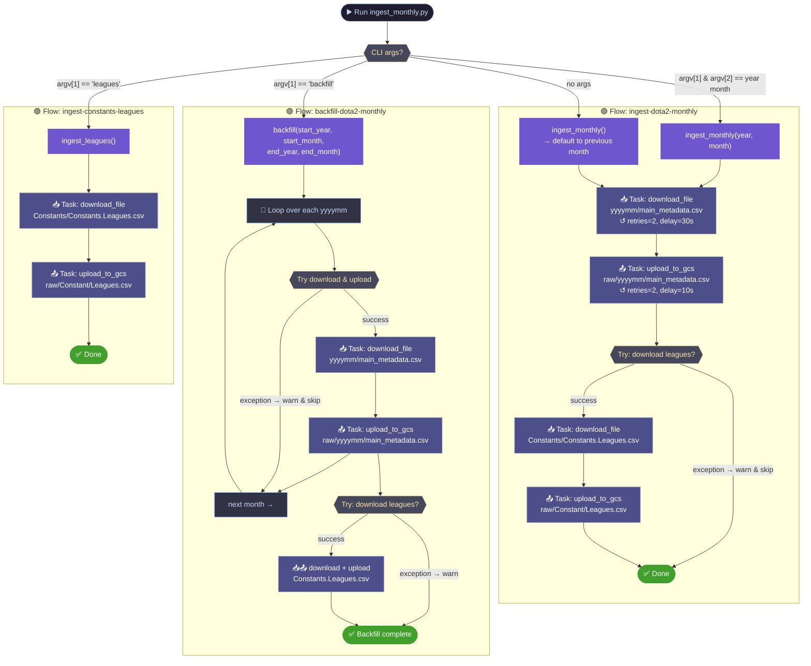
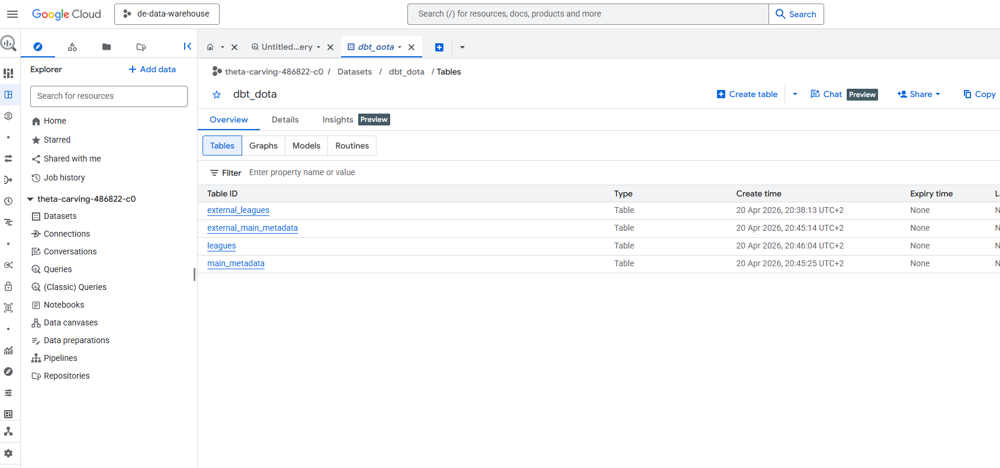
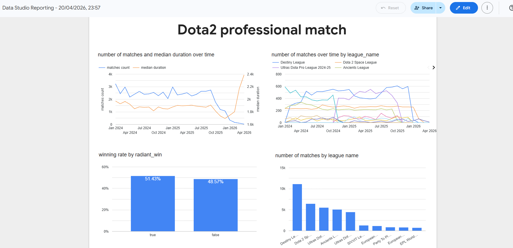

# Dota 2 Pro Match Analytics — Data Engineering Final Project

## Problem Statement

Dota 2 is a 2013 multiplayer online battle arena (MOBA) video game by Valve, played in matches between two teams of five players — **Radiant** and **Dire** — each defending their own base on an asymmetric map.

> *"Dota 2 is played in matches between two teams of five players, with each team occupying and defending their own separate base on the map. Each of the ten players independently controls a powerful character known as a 'hero' that all have unique abilities and differing styles of play."*
> — [Wikipedia](https://en.wikipedia.org/wiki/Dota_2)
> — please attach picture from [pictures/do]


After years of playing, two observable trends motivated this project:

1. **Increasing match duration** — as the map has grown larger and more resources have been introduced over successive patches, professional matches appear to run longer.
2. **Side imbalance** — due to asymmetric resource distribution on the map, the Radiant and Dire sides may have measurably different win rates.

The goal of this project is to build an end-to-end data pipeline that ingests professional match data, transforms it into analytics-ready models, and surfaces findings in an interactive dashboard.

---

## Data Source

**Kaggle:** [Dota 2 Pro League Matches 2023](https://www.kaggle.com/datasets/bwandowando/dota-2-pro-league-matches-2023)

- Professional match data from 2016 to present
- Updated on a weekly basis
- Key files: `main_metadata.csv` (per year/month, it stores the metadata per match, for example start_date, duration, win/loss, match_id, league_id etc)
           `Constants/Constants.Leagues.csv` (the list of leagues and tiers, updated actively)
     
---


## Architecture & Methodology



### Technology Choices

| Layer | Tool | Purpose |
|---|---|---|
| Cloud Infrastructure | **Terraform** + **Google Cloud** | Provision GCS bucket and BigQuery dataset as code |
| Data Lake | **Google Cloud Storage (GCS)** | Store raw CSV files partitioned by year/month |
| Workflow Orchestration | **Prefect** | Schedule and monitor monthly ingestion tasks |
| Data Warehouse | **BigQuery** | Store and query structured match data at scale |
| Data Transformation | **dbt** | Model, test, and document analytics-ready tables |
| Dashboard | **Looker Studio** | Visualize trends and findings |


## Data Pipeline Detail

### 1. Infrastructure Provisioning (Terraform)

Terraform provisions all cloud resources declaratively, ensuring reproducibility.

- **GCS bucket** `de-dota2` (region: US) with lifecycle rules for incomplete multipart uploads
- **BigQuery dataset** `main_metadata` in project `theta-carving-486822-c0`
- Credentials are loaded from `credentials/gcs_service_account.json`

```bash
cd terraform
terraform init
terraform apply
```

### 2. Data Ingestion

**Historical load (2022–2025):** `ingest_dota2_data.py`

Downloads each year's `main_metadata.csv` from Kaggle via `kagglehub` and uploads it to GCS at `raw/{year}/main_metadata.csv`. Files are uploaded in 8 MB chunks and verified after upload.

```bash
# Run manually for a historical bulk load
python ingest_dota2_data.py
```
**Ongoing monthly load (2026+):** `prefect/flows/ingest_monthly.py`

A Prefect flow scheduled to run monthly. It downloads the previous month's match file and the latest leagues constants file, then uploads both to GCS. Tasks include retry logic (2 retries, 30-second delay) for resilience.

```bash
# Run manually for a specific month (positional args: year month)
python prefect/flows/ingest_monthly.py 2026 4

# Backfill multiple months
python prefect/flows/ingest_monthly.py backfill

# Refresh leagues constants only
python prefect/flows/ingest_monthly.py leagues
```

**Prefect flow diagram:**




**Ingested tables in GCS:** :


### 3. BigQuery — External & Materialized Tables

Raw CSV files in GCS are registered as **external tables** in BigQuery, then materialized into native tables for query performance.

```sql
-- Creating external table referring to gcs path
CREATE OR REPLACE EXTERNAL TABLE `theta-carving-486822-c0.dbt_dota.external_main_metadata`
OPTIONS (
  format = 'csv',
  uris = ['gs://de-dota2/raw/2024/main_metadata.csv','gs://de-dota2/raw/2025/main_metadata.csv','gs://de-dota2/raw/20260*/main_metadata.csv']
);

CREATE OR REPLACE EXTERNAL TABLE `theta-carving-486822-c0.dbt_dota.external_leagues`
OPTIONS (
  format = 'csv',
  uris = ['gs://de-dota2/raw/Constant/Leagues.csv']
);


-- Creating materialized table for better query performance
CREATE OR REPLACE TABLE `theta-carving-486822-c0.dbt_dota.main_metadata` AS
SELECT * FROM `theta-carving-486822-c0.dbt_dota.external_main_metadata`;

CREATE OR REPLACE TABLE `theta-carving-486822-c0.dbt_dota.leagues` AS
SELECT * FROM `theta-carving-486822-c0.dbt_dota.external_leagues`;
```

**processed tables in data warehouse:** :



### 4. Data Transformation (dbt)

The dbt project `dbt_dota` (located in `dbt_dota/`) applies a two-layer transformation strategy:

**Staging layer** (`models/staging/`)

| Model | Description |
|---|---|
| `stg_leagues` | Cleans and casts raw league data; excludes null tiers |
| `stg_main_metadata` | Cleans and casts raw match data; deduplicates by `match_id` using `ROW_NUMBER()` |

**Marts layer** (`models/marts/`)

| Model | Materialization | Description |
|---|---|---|
| `dim_leagues` | Table | Deduplicated dimension of leagues with tier classifications |
| `fact_main_metadata` | Incremental (merge on `match_id`) | Fact table joining match metrics with league dimension; incrementally updated on `start_datetime` |

**Data tests** are defined in `schema.yml` files for both layers, covering uniqueness, nullability, and referential integrity between fact and dimension tables.

```bash
cd dbt_dota
dbt run
dbt test
```

### 5. Dashboard (Looker Studio)

The final dashboard connects to the `fact_main_metadata` and `dim_leagues` BigQuery tables to surface:

- Trend of average match duration over patch versions
- Radiant vs. Dire win rate comparison
- Match volume by league tier over time

**[View Dashboard](https://datastudio.google.com/reporting/aff70da2-c27a-4443-aca7-ad8a72cb49eb)**



#### Key Findings

- **Match duration is increasing** — The average duration of professional matches has grown over time, consistent with the hypothesis that a larger map and more in-game resources lead to longer games.
- **Match volume declined from early 2026** — The number of recorded matches dropped noticeably from the start of 2026. The exact cause is unclear and could reflect factors such as tournament scheduling, data availability, or shifts in the professional scene.
- **Radiant has a slightly higher win rate** — The Radiant side wins marginally more often than Dire, suggesting a mild map-side advantage that may be worth investigating further.

---

## Quick Start Reproducibility

**Prerequisites:** Python environment with dependencies installed (`pyproject.toml`), GCP account with billing enabled, Kaggle account.

```bash
# Step 1 — Clone the repository
git clone https://github.com/liuxinyuan0829/data-engineering-final-project.git
cd data-engineering-final-project

# Step 2 — Set up GCP IAM service account
# 1. Go to https://console.cloud.google.com/iam-admin/serviceaccounts
# 2. Create a service account (e.g. "de-dota2-sa") with the following roles:
#      - Storage Admin         (read/write GCS)
#      - BigQuery Admin        (create datasets, tables, run queries)
# 3. Create a JSON key for the service account
# 4. Download the key and save it to:
mkdir -p credentials
mv ~/Downloads/<your-key-file>.json credentials/gcs_service_account.json

# Step 3 — Configure environment variables
cp .env.example .env
# Edit .env and fill in your values:
#   KAGGLE_USERNAME  — your Kaggle username
#   KAGGLE_KEY       — your Kaggle API key (from https://www.kaggle.com/settings)
#   GCP_PROJECT, GCS_BUCKET, GOOGLE_APPLICATION_CREDENTIALS (pre-filled)

# Load environment variables
set -a && source .env && set +a

# Step 4 — Provision cloud infrastructure
cd terraform && terraform init && terraform apply && cd ..

# Step 5 — Bulk-load historical data (2022–2025)
python ingest_dota2_data.py

# Step 6 — Trigger monthly runs for 2026+

# Run for a specific month (positional args: year month)
python prefect/flows/ingest_monthly.py 2026 4

# Backfill multiple months
python prefect/flows/ingest_monthly.py backfill

# Refresh leagues constants only
python prefect/flows/ingest_monthly.py leagues

# Step 7 — Create BigQuery external + materialized tables
# Run the SQL statements in the BigQuery section above

# Step 8 — Run dbt transformations and tests
cd dbt_dota && dbt run && dbt test

# Step 9 — Open Looker Studio dashboard
# https://datastudio.google.com/reporting/aff70da2-c27a-4443-aca7-ad8a72cb49eb
```

---

## Project Structure

```
├── credentials/                  # GCP service account key (not committed)
├── terraform/                    # Infrastructure as code
│   ├── main.tf                   # GCS bucket + BigQuery dataset definitions
│   └── variables.tf              # Project, region, bucket, dataset variables
├── ingest_dota2_data.py          # Historical bulk ingestion (2022–2025)
├── prefect/
│   └── flows/
│       └── ingest_monthly.py     # Scheduled monthly ingestion flow (2026+)
├── dbt_dota/                     # dbt transformation project
│   ├── models/
│   │   ├── staging/              # stg_leagues, stg_main_metadata
│   │   └── marts/                # dim_leagues, fact_main_metadata
│   └── dbt_project.yml
└── README.md
```